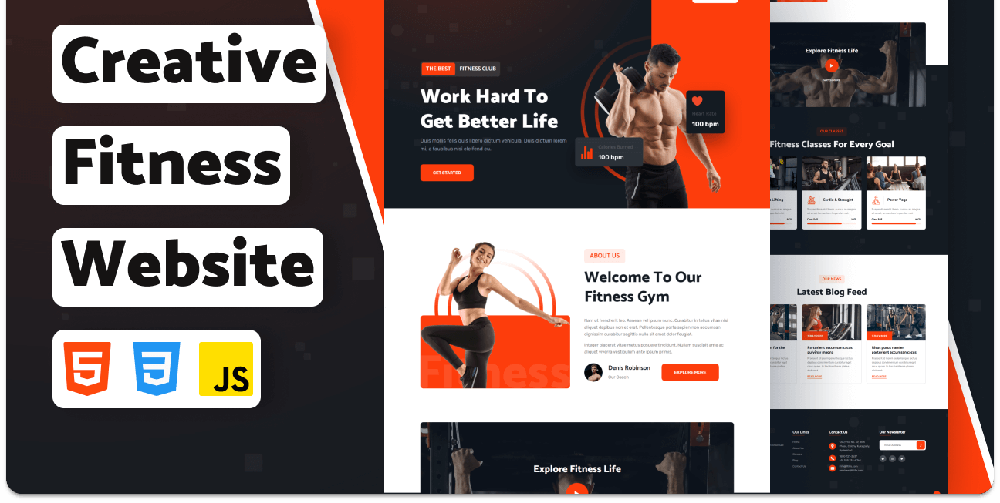

<div align="center">
  <br />
  <br />

  <h2 align="center">FitFlex - Fitness Website</h2>

  Fitlife is a fully responsive fitness website, <br />Responsive for all devices, build using HTML, CSS, and JavaScript.
  <br />FitFlex Gym is your ultimate destination for achieving your fitness goals in Faridkot, Punjab. Our state-of-the-art facilities, experienced trainers, and diverse range of fitness programs cater to individuals of all fitness levels. Whether you're looking to lose weight, build muscle, improve flexibility, or enhance overall health, our supportive environment and personalized approach ensure that you can reach your full potential. Join us today and start your journey towards a healthier, stronger you!

  <a href="https://github.com/Manjinder5911/FitFlex"><strong>➥ Live Demo</strong></a>

</div>

<br />

### Demo Screeshots



### Prerequisites

Before you begin, ensure you have met the following requirements:

* [Git](https://git-scm.com/downloads "Download Git") must be installed on your operating system.

### Run Locally

To run **Fitlife** locally, run this command on your git bash:

Linux and macOS:

```bash
sudo git clone https://github.com/Manjinder5911/FitFlex.git
```

Windows:

```bash
git clone https://github.com/Manjinder5911/FitFlex.git
```

### License

This project is **free to use** and does not contains any license.
